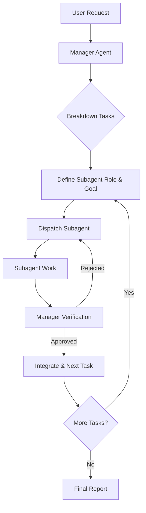

# Subagent Manager Workflow

This workflow defines the standard operating procedure for orchestrating complex tasks using a Manager Agent and dynamic Subagents.

## Core Principle

**Manager Orchestration**: A single "Manager" agent is responsible for breaking down the high-level goal, defining specific sub-tasks, spinning up specialized "Expert Subagents" to execute them, and **verifying** their work before considering a task complete.

## When to Use

- **Complex Tasks**: Multi-step features, system-wide refactors, or architectures requiring coordination.
- **Multiple Domains**: Tasks involving frontend, backend, database, and infrastructure changes simultaneously.
- **High Reliability**: When "fire and forget" is insufficient and strict verification is required.

## The Workflow

## Step-by-Step Instructions

1.  **Initialize Manager**:
    - Adopt the persona of the **Manager Agent**.
    - Analyze the user's request and create a high-level plan in `task.md`.

2.  **Dispatch Loop** (For each sub-task):
    - **Identify Expertise**: Determine the specific skill set needed (e.g., "React Expert", "Security Auditor", "Database Architect").
    - **Define Goal**: Write a clear, atomic goal for the subagent.
    - **Dispatch**: Use the `task` tool (or equivalent subagent invocation) to start the subagent with its specific instructions.
      - _Prompt Template_: "You are an expert in [FIELD]. Your goal is [GOAL]. Constraints: [CONSTRAINTS]. Return when [CONDITION]."
    - **Monitor**: Wait for the subagent to return.

3.  **Verification (CRITICAL)**:
    - **Do not trust; verify.** Upon subagent return, reading the output is not enough.
    - **Run Verification**: The Manager MUST run commands to verify the subagent's work (e.g., `npm test`, `curl` endpoints, check file contents).
    - **Feedback Loop**:
      - If verification fails, dispatch the subagent again with specific feedback on what failed.
      - If verification passes, mark the task as done in `task.md`.

4.  **Completion**:
    - Once all tasks are verified, the Manager compiles a summary of work and notifies the user.

## Role Definitions

### Manager Agent

- **Responsibility**: Planning, Delegation, Verification, Integration.
- **Mindset**: Skeptical, Architectural, Big-picture.
- **Tools**: `task_boundary`, `run_command` (for verification), `write_to_file` (for planning).

### Subagent (Expert)

- **Responsibility**: Execution of specific, atomic tasks.
- **Mindset**: Focused, Efficient, Detail-oriented.
- **Scope**: Limited to the assigned task.

## Example Manager Prompt

"I am acting as the Gravity Manager. I see the user wants X. I have broken this down into 3 parts.
Part 1 is Backend API. I will now dispatch a 'Node.js Expert' subagent to implement the endpoint.
[Dispatch]
...
[Subagent Returns]
I will now verify the endpoint by running `curl localhost:3000/api`.
It works. Proceeding to Part 2..."
